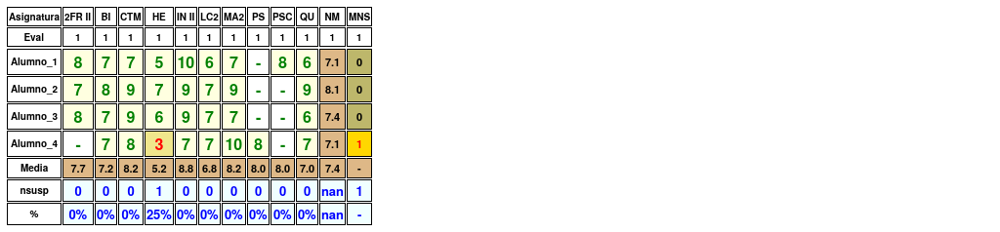
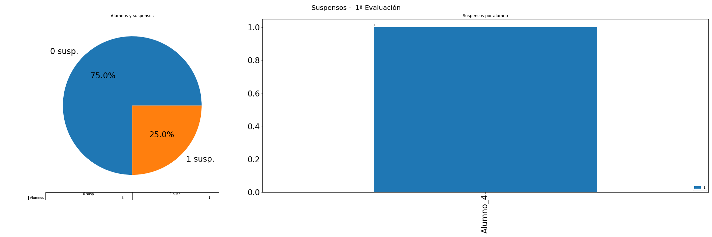
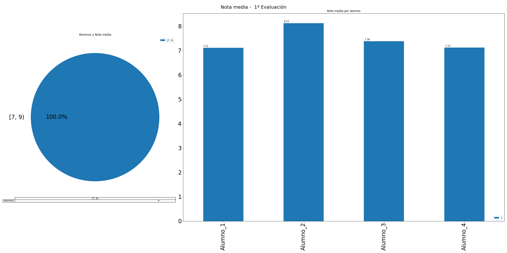

---
title: "Acta de la 1ª evaluación" 
author: IES Pedro Cerrada
date: 4ºESO H
titlepage: true
logo: portada
geometry: landscape,margin=1in
keywords: [Acta]
... 
# Acta de la 1ª evaluación 

 \newpage 

## Resultados generales: 
A nivel de grupo, se tienen los siguientes datos: 
 
* **nota media**: 7.42 
* **número de suspensos**: 1 
* **número de suspensos por alumno**: 0.25 
  
 El número de alumnos por suspensos se distribuyen de la siguiente manera: 

* **0 susp.**: 3 
* **1 susp.**: 1 
* **2 susp.**: 0 
* **3 ó 4 susp.**: 0 
* **> 4 susp.**: 0 
  
 
 
 Gráficamente: 
 
  
 
 
 Alumnos con suspensos: 

* Con **1** asignaturas: 

    - Alumno_4 (HE) 
 
El número de alumnos por nota media se distribuye de la siguiente manera: 

* **[0, 3)**: 0 
* **[3, 4)**: 0 
* **[4, 5)**: 0 
* **[5, 6)**: 0 
* **[6, 7)**: 0 
* **[7, 9)**: 4 
* **[9, 10)**: 0 
  
 

 Gráficamente 
 
  
 

## Resultados por alumno 

### Alumno_1 

 * **Nota media**: 7.11, **Número de suspensos**: 0 
  
 
|   Eval |   2FR II |   BI |   CTM |   HE |   IN II |   LC2 |   MA2 |   PSC |   QU |
|:------:|:--------:|:----:|:-----:|:----:|:-------:|:-----:|:-----:|:-----:|:----:|
|      1 |        8 |    7 |     7 |    5 |      10 |     6 |     7 |     8 |    6 |

 * Resultados: **2FR II**: 8, **BI**: 7, **CTM**: 7, **HE**: 5, **IN II**: 10, **LC2**: 6, **MA2**: 7, **PSC**: 8, **QU**: 6 
  
 

 * Observaciones: Aquí irían las observaciones del alumno 1

### Alumno_2 

 * **Nota media**: 8.12, **Número de suspensos**: 0 
  
 
|   Eval |   2FR II |   BI |   CTM |   HE |   IN II |   LC2 |   MA2 |   QU |
|:------:|:--------:|:----:|:-----:|:----:|:-------:|:-----:|:-----:|:----:|
|      1 |        7 |    8 |     9 |    7 |       9 |     7 |     9 |    9 |

 * Resultados: **2FR II**: 7, **BI**: 8, **CTM**: 9, **HE**: 7, **IN II**: 9, **LC2**: 7, **MA2**: 9, **QU**: 9 
  
 

 * Observaciones: Aquí irían las observaciones del alumno 2

### Alumno_3 

 * **Nota media**: 7.38, **Número de suspensos**: 0 
  
 
|   Eval |   2FR II |   BI |   CTM |   HE |   IN II |   LC2 |   MA2 |   QU |
|:------:|:--------:|:----:|:-----:|:----:|:-------:|:-----:|:-----:|:----:|
|      1 |        8 |    7 |     9 |    6 |       9 |     7 |     7 |    6 |

 * Resultados: **2FR II**: 8, **BI**: 7, **CTM**: 9, **HE**: 6, **IN II**: 9, **LC2**: 7, **MA2**: 7, **QU**: 6 
  
 

 * Observaciones: Aquí irían las observaciones del alumno 3

### Alumno_4 

 * **Nota media**: 7.12, **Número de suspensos**: 1 
  
 

* Suspensos: HE 

|   Eval |   BI |   CTM |   HE |   IN II |   LC2 |   MA2 |   PS |   QU |
|:------:|:----:|:-----:|:----:|:-------:|:-----:|:-----:|:----:|:----:|
|      1 |    7 |     8 |    3 |       7 |     7 |    10 |    8 |    7 |

 * Resultados: **BI**: 7, **CTM**: 8, **HE**: 3, **IN II**: 7, **LC2**: 7, **MA2**: 10, **PS**: 8, **QU**: 7 
  
 

 * Observaciones: Aquí irían las observaciones del alumno 4